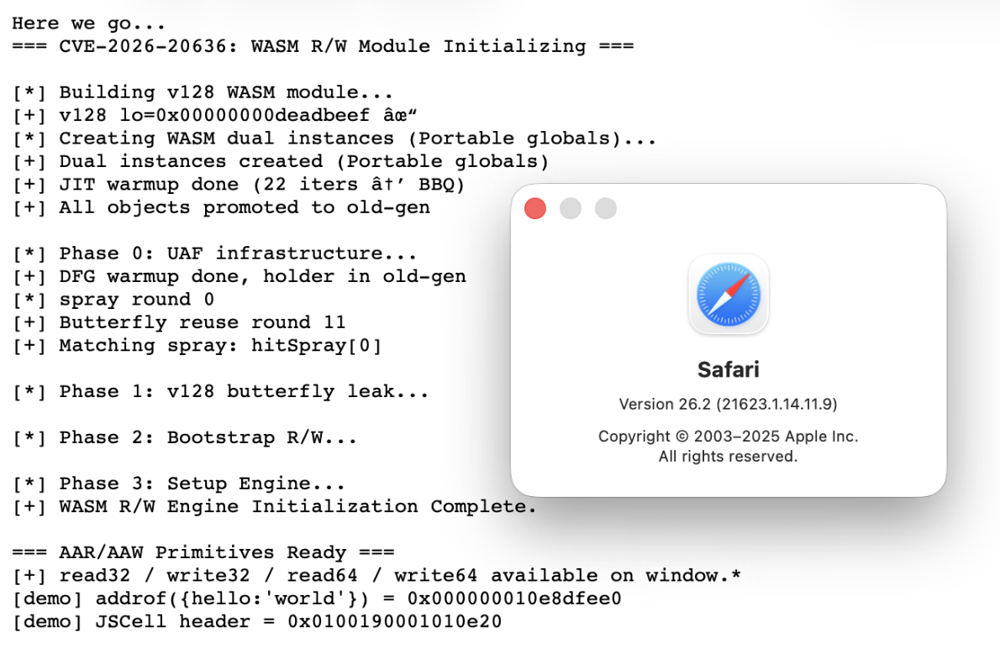

# Safari DFG JIT Type Confusion → Arbitrary Read/Write

> [!WARNING]
> **The CVE ID in this repository name is fictional.** No CVE was assigned for this vulnerability. It was discovered through independent WebKit source code auditing.

A single-token type declaration error in WebKit's DFG JIT compiler, escalated from a GC write barrier bypass to stable arbitrary memory read/write on stock iPhone (iOS 26.1) and macOS 26.2.

**End-to-end success rate: ~80%.** In failure cases, the page simply reloads; crashes are rare.



## Vulnerability

`Source/JavaScriptCore/dfg/DFGNodeType.h`, line 592:

```c
macro(MapIterationEntryKey,   NodeResultInt32)   // ← BUG: should be NodeResultJS
macro(MapIterationEntryValue, NodeResultJS)      // ← correct
```

`MapIterationEntryKey` — the node that extracts the key in a `Map.forEach()` callback — is declared as producing a 32-bit integer. In reality, its runtime operation returns an arbitrary `JSValue` (a 64-bit NaN-boxed value that may contain a heap object pointer).

The DFG Store Barrier insertion phase trusts this declaration: if the value is `Int32`, it cannot be a heap pointer, so the GC write barrier is skipped. When the callback stores the key into a tenured object's property, the garbage collector never learns about the cross-generational reference — and the next Eden GC collects the key object while a dangling pointer remains.

**Fix**: [`3f6f7836068`](https://commits.webkit.org/308853@main) — change `NodeResultInt32` to `NodeResultJS`. One token.

| | |
|---|---|
| **Affected** | Safari ≤ 26.2 (WebKit `21623.1.14.11.9`) |
| **Discovery** | Independent source code audit |

## Exploit Chain

```
DFG NodeResultInt32 declaration error
    │
    ▼
Phase 1: UAF
    StoreBarrierInsertionPhase::Fast
    child->result() == NodeResultInt32 → skip FencedStoreBarrier
    │
    ▼
Eden GC: tenured holder not in remembered set → key object collected
    │
    ▼
Phase 2: addrof / fakeobj
    Spray JSArray → Cell: IsoSubspace (no reuse) / Butterfly: Gigacage (reused!)
    DoubleShape cell reads NaN-boxed pointer as raw float64 = addrof
    DoubleShape cell writes raw bits, JSArray reads as JSValue = fakeobj
    │
    ▼
Phase 3: WASM Dual-Instance R/W Engine
    v128 global offset scan → containerBF / structArrBF (no describe()!)
    Bootstrap R/W → locate Portable global value slots
    Redirect Navigator.g0_slot → Executor.g1_slot
    │
    ▼
✓ Arbitrary Memory Read/Write (read32 / write32 / read64 / write64)
```

### Phase 1 → 2: UAF to addrof/fakeobj

The freed victim object's **cell** lives in CompleteSubspace (JSFinalObject) and its **butterfly** lives in the Gigacage (bmalloc). When we spray `JSArray`s, their cells go to IsoSubspace (no overlap), but their butterflies reuse the same Gigacage memory. The dangling cell retains its DoubleShape indexing type — reading its elements interprets NaN-boxed object pointers as raw `float64` (addrof); writing raw bits and reading from the overlapping JSArray yields a fake JSValue (fakeobj).

**iPhone-specific adaptations:**
- **Cell Sled**: 64 same-shape `{0: 0.0}` objects allocated *after* `storeKey()` prevent `StructureID=0` crash (freelist tail issue unique to iOS GC behavior)
- `deepClobber(300)` to clobber deeper ARM64 stack frames
- `await sleep(50)` for iOS concurrent GC completion
- 3,000–5,000 iteration DFG warmup for reliable callback inlining

### Phase 3: WASM Dual-Instance R/W Engine

Traditional `fake Float64Array` is impractical on modern JSC (StructureID guessing, GC crashes, NaN canonicalization). Instead, we use WebAssembly Portable globals:

1. Create a 90-byte WASM module with 2 mutable globals (`i64 g0`, `i32 g1`)
2. Instantiate twice: **Executor** and **Navigator**, each with their own `WebAssembly.Global` imports
3. JIT warmup (22 iterations → BBQ compilation)
4. Use bootstrap R/W to redirect Navigator's `g0` value slot pointer → Executor's `g1` value slot
5. Navigator writes an address to `g0` → actually writes to Executor's `g1` → Executor reads `g1` at that address

```javascript
read32 = function(addr) {
    navigator_.exports.b(addr);        // set address (via redirected g0 → executor.g1)
    return executor.exports.c() >>> 0;  // read value
};
```

**Safari bootstrap** (no `describe()` API): v128 global offset scan at `+0x80..+0x300` within the WASM Instance object locates butterfly addresses without any shell-only APIs. Cross-validated with two target arrays for false-positive elimination.

## Files

| File | Description |
|---|---|
| `index.html` | Exploit entry page (loads engine, demos addrof + JSCell read) |
| `wasm_rw.js` | Complete exploit: UAF → addrof/fakeobj → WASM R/W engine |
| `poc_addrof.html` | Standalone addrof PoC (two-button interactive test) |
| `logging.js` | XHR-based debug logging (batched POST to server) |
| `server.js` | Bun dev server (HTTP + WebSocket + `/log` endpoint) |

## Usage

**Requirements:** iPhone / [vphone](https://github.com/Lakr233/vphone-cli) (iOS 26.1) or macOS 26.2 with Safari ≤ 26.2; [Bun](https://bun.sh) runtime.

```bash
# Start the dev server
bun run server.js

# On the target device, navigate to:
#   http://<YOUR_IP>:8080/
# for the full exploit (UAF → AAR/AAW demo)
#
#   http://<YOUR_IP>:8080/poc_addrof.html
# for standalone addrof verification (interactive buttons)
```

The exploit runs automatically on page load. On success (~80%), the page prints leaked heap addresses and JSCell headers. On failure, the page reloads cleanly.

After exploitation, call `teardown_wasm_rw()` from the console to safely restore internal state and prevent post-exploit GC crashes.

## Key Debugging Insights

| # | Problem | Root Cause | Solution |
|---|---|---|---|
| 1 | iPhone crash at null+0x4c | Victim cell becomes freelist tail, StructureID=0 | Cell sled: 64× `{0:0.0}` after storeKey |
| 2 | `addrof(wasmInstance)` = NaN | WASM compilation GC overwrites stale cell | Move WASM alloc before butterfly overlap |
| 3 | Butterfly pointer has 0x0002 prefix | DoubleEncodeOffset corrupts inline properties | Use DoubleArray butterfly elements |
| 4 | `read64` returns undefined | IndexingHeader.publicLength=0 | Fallback offset reads |
| 5 | WebSocket messages queue until disconnect | sync ws.send() only enters buffer | XHR POST + setInterval flush |

## References

- **Detailed Writeup**: [DFG JIT Type Confusion to iPhone AAR/AAW](https://ret0.dev/posts/dfg-jit-type-confusion-to-iphone-aar-aaw/)
- **WebKit Source & Fix**: [DFGNodeType.h](https://github.com/WebKit/WebKit/blob/2efbd919e75cb36a5e50ebaeef2ba26f7565f2fb/Source/JavaScriptCore/dfg/DFGNodeType.h#L597), `NodeResultInt32` → `NodeResultJS` ([`3f6f7836068`](https://commits.webkit.org/308853@main))

## License

This project is released for educational and authorized security research purposes only. Use responsibly.
